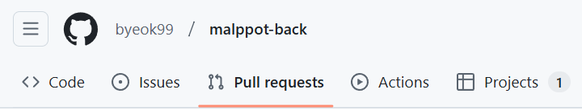
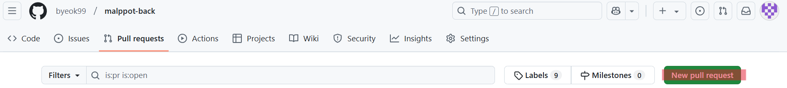
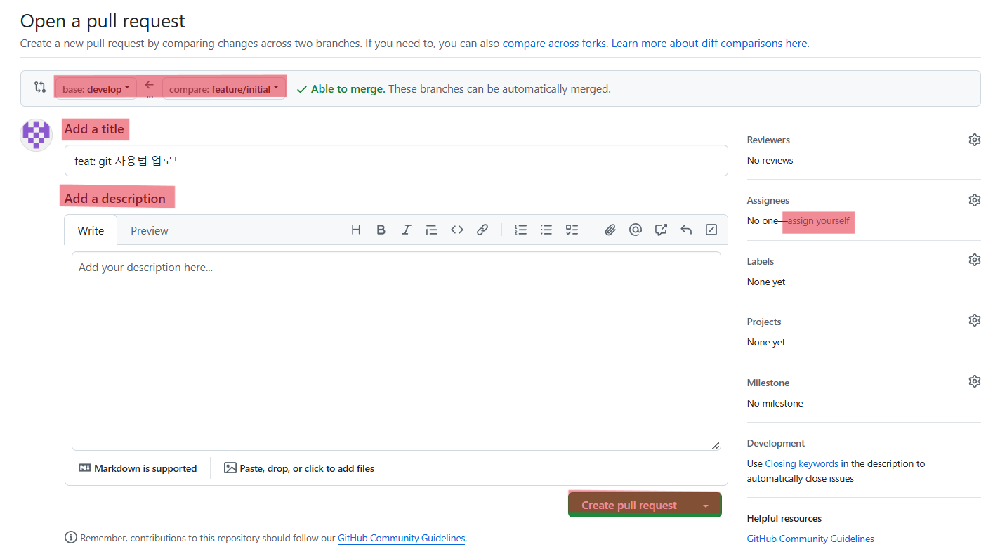
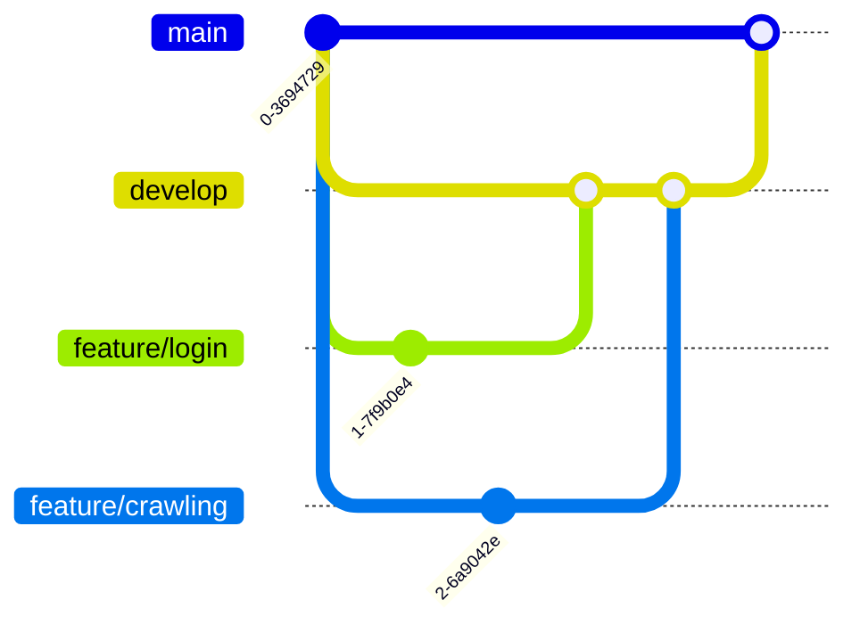

# 브랜치 전략

- `main`: 프로그램이 배포용 브랜치. (개발 완료후 사용될 예정)
- `develop`: 개발 중간 과정에서 사용할 브랜치. (기능이 완성되면 이 브랜치로 병합)
- `feature`: 기능 개발에 사용되는 브랜치. 이 브랜치에서 개발한 후, PR 받은 다음 `develop`으로 병합
- `refactor`: 기능 수정에 사용되는 브랜치. 이 브랜치에서 수정한 후, PR 받은 다음 `develop`으로 병합

## 브랜치 이동

```bash
git checkout develop
git pull origin develop
git checkout -b feature/기능-이름
```

## 브랜치 업로드

```bash
git add .
git commit -m "feat: OOO기능 구현"
git push origin feature/기능-이름
```

## 기능 개발 완료 후 코드 검토 받기

1. [프로젝트 github](https://github.com/byeok99/malppot-back)로 이동

2. 

3. 

4. 

> [!IMPORTANT]
> `assign yourelf`를 누르기만 하면 됩니다.
> 전부 작성했는지 확인 하고 `Create pull request` 눌러주세요.

## 브랜치 이동 예시


